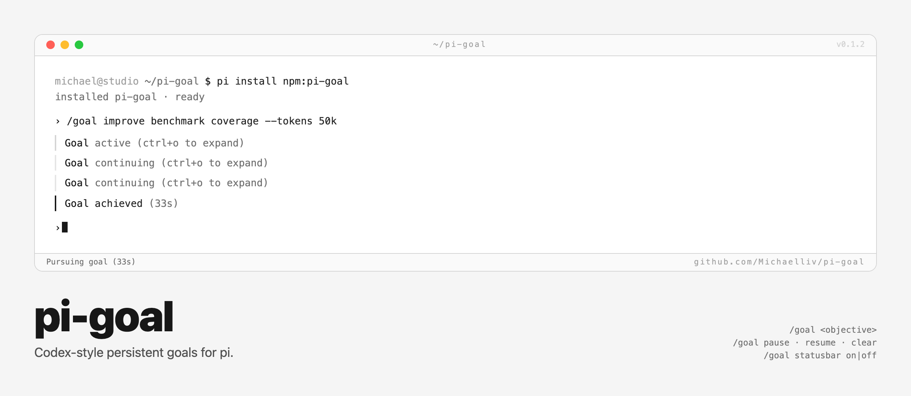

# pi-goal



Persistent autonomous goals for [pi](https://github.com/badlogic/pi-mono).

`pi-goal` adds a `/goal` command and goal tools so Pi can keep working toward a long-running objective until the goal is complete, paused, cleared, or token-budget-limited.

## Install

```bash
pi install npm:pi-goal
```

Or from git:

```bash
pi install git:github.com/manthedan/pi-goal
```

## Usage

```text
/goal improve benchmark coverage until the suite has strong evidence
/goal --tokens 50k finish the migration and verify tests
/goal --max-turns 20 --max-minutes 60 --checkpoint 5 finish the migration
/goal status
/goal pause
/goal resume
/goal clear
/goal export [file]
/goal import <file>
/goal statusbar off
```

When a goal is active, the extension shows compact visible lifecycle markers like `Goal active` and `Goal continuing`; expand them with `ctrl+o` to inspect the objective and usage. The actual continuation instructions are injected into the next turn's system prompt, so the full prompt does not clutter the transcript.

The same Pi agent keeps running normal turns in the same session context until it calls `update_goal({ status: "complete" })`, the user pauses/clears it, or the token budget is reached. Reloading Pi pauses an active goal instead of silently resuming it; use `/goal resume` to continue.

## What it adds

- `/goal [--tokens 50k] [--max-turns 20] [--max-minutes 60] [--checkpoint 5] <objective>`: set or replace a goal
- `/goal status`: show the current goal
- `/goal pause`: stop autonomous continuation without deleting the goal
- `/goal resume`: reactivate a paused goal
- `/goal clear`: remove the goal
- `/goal export [file]`: export the objective, progress, and evidence ledger to Markdown
- `/goal import <file>`: import a Markdown or JSON goal export as a paused goal
- `/goal statusbar on|off`: show or hide the footer status line
- `get_goal` tool: read current goal state
- `update_goal` tool: model can only mark the goal `complete`
- footer status with compact progress: turns, tokens/time, limits, and last action

## Flow

```text
/goal <objective>
  -> persist goal in the current Pi session
  -> show compact Goal marker and footer status
  -> inject hidden continuation instructions into the next system prompt
  -> trigger an agent turn
  -> account time/tokens on turn_end
  -> queue another continuation on agent_end while active
  -> stop when update_goal marks complete, user pauses/clears, or budget is hit
```

## Completion behavior

The model is instructed to audit completion against real evidence before calling `update_goal`. The `update_goal` tool deliberately accepts only `status: "complete"`; pausing, resuming, clearing, checkpointing, anti-thrash pauses, and budget limiting are controlled by the user or extension runtime.

## Hardened fork additions

- Safer continuation scheduling: continuations are rechecked against idle/pending state before prompt injection.
- Per-session runtime state keyed by session file/id instead of one module-global goal.
- Hard stop controls: token budget, max turns, and max minutes.
- Checkpoints: pause every N turns with `/goal --checkpoint N ...`.
- Better progress UI in the footer and expanded goal events.
- Evidence ledger: tool results, commands, tests, and file actions are persisted with the goal.
- Anti-thrash pause when repeated actions or no file-changing activity suggest the loop is stuck.
- Budget warnings at 80% and 95% of token budget.
- Export/import for carrying goal state across sessions or branches.

## State

Goal state is stored as Pi custom session entries with `customType: "pi-goal"`. It follows the active session branch, survives reloads, and does not require an external database.

## Development

Run the extension load check and package tests before publishing changes:

```bash
npm run check
npm test
```

`npm test` verifies the package manifest, documented goal controls, roadmap coverage, and that the extension loads through Pi.

## License

MIT
